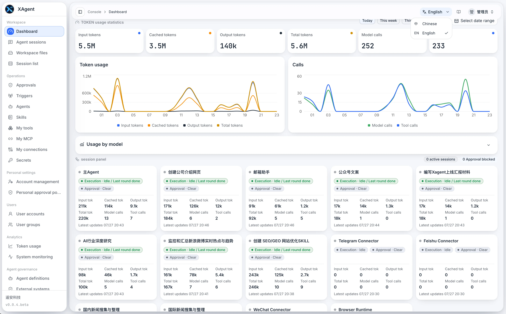

# xAgent Releases

[简体中文](README.zh-CN.md)

This repository distributes official xAgent Server binary releases. It contains
release artifacts, checksums, metadata, and licensing documents, but no xAgent
source code.

Current release: [xAgent v0.0.12.beta](https://github.com/coffeehc/xagent-releases/releases/tag/v0.0.12.beta)

Documentation:

- [xAgent Documentation](https://xagent.xiagaogao.com/en/)
- [Start Installing xAgent](https://xagent.xiagaogao.com/en/docs/getting-started/install/)
- [xAgent Product Overview](https://xagent.xiagaogao.com/en/docs/getting-started/what-is-xagent/)
- [What Is a Connector?](https://xagent.xiagaogao.com/en/docs/getting-started/what-is-connector/)

## What Is xAgent?

xAgent is the unified AI work platform for the enterprise. Deploy it on your own
servers, connect existing systems quickly, centralize access and cost controls,
and audit every action. Employees can get work done with AI from the Web or a
mobile device, giving enterprises control and employees an effortless
experience.

xAgent acts as both an AI portal for employees and an AI foundation for the
organization. It can understand goals, work with documents, analyze data,
create deliverables, call approved tools, and continue work across connected
systems. Existing system accounts and permissions remain the source of truth;
xAgent does not grant users broader access.



## xAgent v0.0.12.beta

This beta release focuses on:

- A concise three-part Server version in the sidebar, with an administrator
  action to check for updates immediately and continue into the existing
  one-click upgrade flow.
- Model-aware context budgets and automatic compression with one consistent
  cache across compressed summaries, recent messages, and current input.
- A database-paginated My Memory view plus stricter long-term admission that
  rejects Session-only state, questions, hypotheticals, and sensitive data.
- Conditional semantic review for ambiguous or duplicate Memory candidates
  without silently rewriting existing facts.
- Full-file reads for Memory extraction segments, including segments larger than
  the workspace text-preview limit.
- Bounded concurrent Tool calls that preserve completed siblings when another
  call waits for approval or continuation.
- Tool cards that distinguish argument streaming from execution and refuse to
  execute arguments truncated by the model output limit.
- Stable compression status presentation and removal of the manual `/compress`
  command; `/clear-history` remains available.
- Existing-file Tools prefer an accessible `path` and fall back to `file_ref`
  when both identities are supplied.
- Unified xAgentDB storage and startup migration for legacy user databases.
- Safe startup migration of legacy decimal user workspaces to canonical
  hexadecimal names without overwriting current files.
- Platform-incident management that keeps infrastructure faults while excluding
  user, Tool-argument, retry, and cancellation noise.
- Connector Protocol 4.3, multi-resource routing, directory-based Connector
  Skills, and the independent file-transfer Profile remain supported.
- Updated WeChat `0.0.12`, Telegram `0.0.13`, Feishu `0.0.12`, Database `0.0.6`,
  and SSH `0.0.8` Connector recommendations.

The release supports:

- Linux AMD64
- Linux ARM64
- macOS AMD64
- macOS ARM64

See the [release notes](changelog/v0.0.12.beta.md) for user-facing changes and
upgrade notes.

## Install

Linux and macOS use the same installer:

```bash
curl -fsSL https://downloads.xagent.xiagaogao.com/scripts/install.sh | bash
```

The installer detects the platform, downloads and verifies the matching
package, installs or upgrades xAgent, and can optionally install supported
Connectors. Debian Linux with systemd is recommended for long-running server
deployments. Windows is not currently recommended because it cannot provide the
same managed script sandbox boundary.

Before upgrading, back up the xAgent configuration, database, workspaces, and
Connector state. See the [installation guide](https://xagent.xiagaogao.com/en/docs/getting-started/install/)
for deployment requirements and first-time system setup.

## Manual Download

Release assets are available from [GitHub Releases](https://github.com/coffeehc/xagent-releases/releases).
The `v0.0.12.beta` platform packages are:

```text
xagent-v0.0.12.beta-linux-amd64.tar.gz
xagent-v0.0.12.beta-linux-arm64.tar.gz
xagent-v0.0.12.beta-darwin-amd64.tar.gz
xagent-v0.0.12.beta-darwin-arm64.tar.gz
```

The release also provides:

- `SHA256SUMS`: checksums for archives and release documents.
- `BINARY_SHA256SUMS`: checksums for the executable inside each archive.
- `release.json`: machine-readable version and licensing metadata.
- `LICENSE`, `EULA.md`, and `THIRD_PARTY_NOTICES.md`.

Each archive contains the xAgent executable, README, release metadata, and
licensing documents. It does not contain source code.

## Verify Downloads

Download the checksum files and release assets, then verify them before
installation:

```bash
shasum -a 256 -c SHA256SUMS
```

Linux users can use `sha256sum -c SHA256SUMS`. If you download only one platform
archive, compare its calculated SHA256 value with the matching line in
`SHA256SUMS`.

## Source Code and Licensing

Artifacts in this repository are binary distributions. Publishing them here
does not mean that the corresponding source code is open source. Use of the
software is governed by the `LICENSE`, `EULA.md`, and third-party notices
included with each release.

## Feedback and Security

- [Share an idea or report a general issue](https://xagent.xiagaogao.com/en/docs/cooperation/idea/)
- For security issues containing sensitive details, use the private contact
  channel described in the documentation instead of a public GitHub issue.
