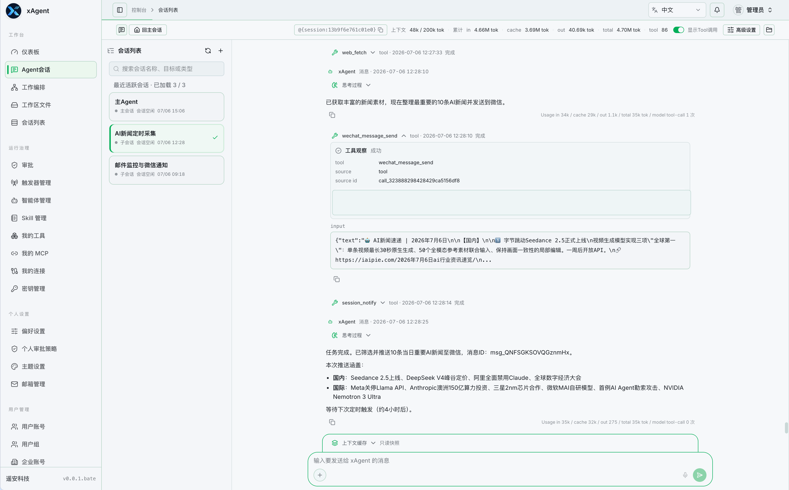

# xAgent Releases

[English](README.md)

本仓库用于发布 xAgent Server 二进制产物。

这是一个公开的发布仓库，主要承载 Release artifacts。相关组件的源码可能维护在其他仓库中，除非某个 Release 或文档明确说明，否则本仓库不代表源码开源。

使用文档：

<https://xagent.xiagaogao.com>

## 什么是 xAgent

xAgent 是面向任务完成的服务端多用户智能工作门户。团队可以在一套系统里准备模型、Skill、工具、连接器、审批策略和工作区边界，再让用户通过 Web 页面或 IM 连接器访问专用智能体。

它不是 CLI 项目，也不只是聊天机器人。xAgent 更关注长期任务执行：理解目标、读取文件、调用工具、生成交付物，并把任务文件保存在按用户隔离的服务端工作区中。

当前版本是测试版二进制发布，适合部署体验、流程验证和早期反馈。免费二进制发布不等同于对应源码已经开源。



## 发布内容

本仓库的 Release 可能包含：

- xAgent Server 二进制文件
- 内嵌 Web UI 的 xAgent 发布包
- 部署示例、校验文件和版本说明

Connector 二进制文件单独发布在：

<https://github.com/coffeehc/xagent-connectors>

每个 Release 会说明该版本包含的目标平台和运行要求。

## 下载

请从 GitHub Releases 页面下载：

<https://github.com/coffeehc/xagent-releases/releases>

常见产物名称示例：

```text
xagent-linux-amd64.tar.gz
xagent-darwin-arm64.tar.gz
SHA256SUMS
```

不同版本的文件名和支持平台可能不同，请以对应 Release 页面中的附件为准。

## 校验

如果 Release 提供 `SHA256SUMS`，建议在安装前校验下载文件：

```bash
shasum -a 256 -c SHA256SUMS
```

在 Linux 环境中，也可以根据 Release 中的校验文件格式使用 `sha256sum`。

## 版本规则

Release tag 使用语义化风格版本号：

```text
vMAJOR.MINOR.PATCH
```

示例：

```text
v1.0.0
v1.1.0
v1.1.1
```

预发布版本可以使用以下后缀：

```text
v1.2.0-rc.1
v1.2.0-beta.1
```

## 兼容性

兼容性以每个 Release 的说明为准。升级前请重点查看：

- 支持的操作系统和 CPU 架构
- 配置文件是否需要调整
- 数据是否需要迁移
- 已知的不兼容变更

## 源码与授权

本仓库发布的是二进制产物。

在本仓库发布二进制文件，不等同于对应源码已经开源。如果某个组件存在单独的源码仓库、授权协议或开源说明，会在对应 Release 或相关文档中明确说明。

## 安全反馈

如果安全问题包含敏感细节，请不要通过公开 GitHub Issue 提交。请使用项目维护者提供的联系渠道，或参考对应 Release 文档中的安全反馈说明。
