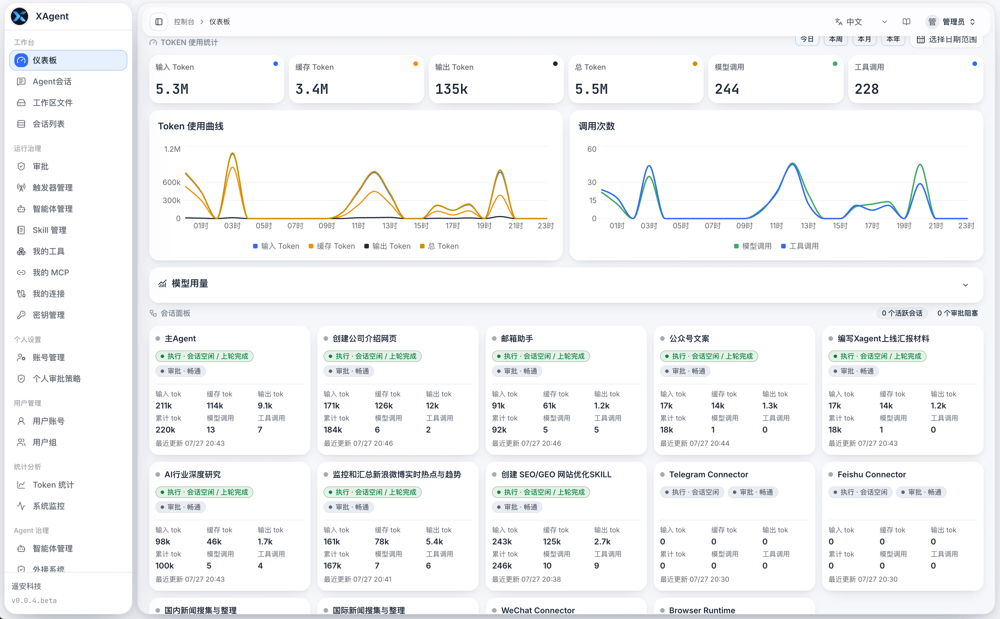

# xAgent Releases

[English](README.md)

本仓库用于发布 xAgent Server 官方二进制版本，仅包含发布包、校验文件、版本元数据和授权文件，不包含 xAgent 源代码。

当前版本：[xAgent v0.0.21.beta](https://github.com/coffeehc/xagent-releases/releases/tag/v0.0.21.beta)

使用文档：

- [xAgent 使用手册](https://xagent.xiagaogao.com/)
- [开始安装 xAgent](https://xagent.xiagaogao.com/docs/getting-started/install/)
- [xAgent 产品介绍与核心能力](https://xagent.xiagaogao.com/docs/getting-started/what-is-xagent/)
- [插件](https://xagent.xiagaogao.com/docs/user-guide/agent-plugins/)

## 什么是 xAgent

xAgent 是企业统一的 AI 工作平台。服务端部署，快速接入现有系统，权限与成本集中管控、操作全程审计；员工打开网页或手机，即可使用 AI 完成工作。实现企业可管、员工好用。

xAgent 既是员工统一使用 AI 的入口，也是企业统一管理 AI 的基座。它可以理解目标、处理资料、分析数据、生成成果、调用经过授权的工具，并连接企业现有系统继续完成工作。外部系统原有的账号和权限仍然是访问依据，xAgent 不会凭空扩大用户权限。



## xAgent v0.0.21.beta

本测试版重点更新：

- 固定任务角色改用稳定的 Model Profile ID 引用模型，并迁移、校验旧的模型名配置。
- 智能体构建、能力编排、OCR、摘要、Memory 和上下文压缩统一使用严格 JSON 与业务 Schema 校验。
- 长会话压缩使用 90% 请求预算线；模型达到上下文或输出上限时缩小 source 批次重试，未形成净压缩时不推进游标。
- 公共 Skill 使用 v2 目录和逐 Skill 不可变制品；安装状态直接按当前加载的 Skill 投影，不再保存第二份记录。
- 会话停止执行后轮次计时同步停止；缩略导航更紧凑，会话列表恢复稳定固定宽度。
- Agent Role 管理按 profile ID 选择模型；工作编排编辑器可保留当前目录中已不可选但仍被引用的 Skill。
- Office 工具授权方式不变。
- 本版本只更新 xAgent Server，官方 AgentPlugin 制品保持不变。

支持的平台：

- Linux AMD64
- Linux ARM64
- macOS AMD64
- macOS ARM64

完整功能变化和升级说明见[本版更新日志](changelog/v0.0.21.beta.md)。

## 安装

Linux 和 macOS 使用同一个安装命令：

```bash
curl -fsSL https://downloads.xagent.xiagaogao.com/scripts/install.sh | bash
```

安装器会自动识别平台，下载并校验对应发布包，安装或升级 xAgent，并可选择安装支持的 AgentPlugin。长期运行的服务端部署建议使用 Debian Linux 和 systemd。Windows 当前无法提供与 Linux、macOS 同等的受控脚本沙箱边界，因此暂不建议作为部署环境。

升级前请备份 xAgent 配置、数据库、工作区和 AgentPlugin 状态。部署要求和首次系统初始化流程见[开始安装 xAgent](https://xagent.xiagaogao.com/docs/getting-started/install/)。

## 手动下载

发布文件可从 [GitHub Releases](https://github.com/coffeehc/xagent-releases/releases) 下载。`v0.0.21.beta` 提供以下平台包：

```text
xagent-v0.0.21.beta-linux-amd64.tar.gz
xagent-v0.0.21.beta-linux-arm64.tar.gz
xagent-v0.0.21.beta-darwin-amd64.tar.gz
xagent-v0.0.21.beta-darwin-arm64.tar.gz
```

Release 同时提供：

- `SHA256SUMS`：发布包和发布文件的校验值。
- `BINARY_SHA256SUMS`：每个平台包内可执行文件的校验值。
- `release.json`：可供程序读取的版本与授权元数据。
- `LICENSE`、`EULA.md` 和 `THIRD_PARTY_NOTICES.md`。

每个平台包只包含 xAgent 可执行文件、README、版本元数据和授权文件，不包含源代码。

## 校验下载文件

下载校验文件和 Release 附件后，在安装前执行：

```bash
shasum -a 256 -c SHA256SUMS
```

Linux 也可以使用 `sha256sum -c SHA256SUMS`。如果只下载一个平台包，请计算该文件的 SHA256，并与 `SHA256SUMS` 中对应的一行比较。

## 源码与授权

本仓库发布的是二进制产物。在这里提供二进制文件，不代表对应源码已经开源。软件使用范围以每个 Release 中的 `LICENSE`、`EULA.md` 和第三方声明为准。

## 反馈与安全问题

- [提交想法或反馈普通问题](https://xagent.xiagaogao.com/docs/cooperation/idea/)
- 如果安全问题包含敏感信息，请使用文档提供的私密联系方式，不要通过公开 GitHub Issue 提交。
